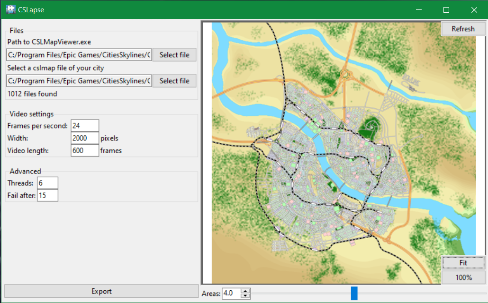

# CSLapse
Create timelapses of your Cities:Skylines cities from regular CSLMapView saves.



# Installation:
The software is available as a precompiled binary for Windows10 x64. Download the latest release from [https://github.com/NotEvenIndian/CSLapse/releases](https://github.com/NotEvenIndian/CSLapse/releases).

The executable has been successfully used on Windows 10 and Windows 11. 

For other systems you might want to build it yourself. To see how you can do this, go to [Building from source](#building-from-source).

# Usage:
**Please note: creating a timelapse certainly puts a heavy load on your CPU, probably on your memory and possibly on your disk.**

This application relies on functionality provided by the [CSLMapView mod](https://steamcommunity.com/sharedfiles/filedetails/?id=845665815). To my knowledge, the executable bundled with the mod only works on Windows. If you can't run the exe on your machine, this application will not work.

Make sure that all your cslmap files are in the same directory and the filenames start with your city's name (default settings for CSLMapView). Make sure you have the newest version (at least 4.x) of CSLMapView installed.

To create a timelapse follow these steps:
1. Run the program
2. Select your CSLMapView.exe file
3. Select a cslmap file of your city
4. Set the settings for the timelapse 
5. Click "Export"
6. Wait until the process finishes.

The program will create an mp4 file in the same folder where your source files are located.
The program may take up to an hour to finish, depending on your hardware, settings and the amount of your files.
It is recommedned to compress the final video with an external software like [freeconvert.com](https://www.freeconvert.com/video-compressor).

# Building from source
You might want to build the software from source. For this you will need git and python3 (at least 3.8) installed.
1. Go to your home directory
2. Copy this repository
```git clone https://github.com/NotEvenIndian/CSLapse.git```
3. ```cd CSLapse```
4. Install the requirements
```pip install requirements.txt```
5. Build the application
```pyinstaller CSLapse.spec```

Your executable will be generated in the dist folder.

# TODO:
* Add GUI to edit settings of CSLMapViewConfig.xml
* Extend documentation
* (maybe) support different filetypes

# Acknowledgements
This project extends upon the [CSLMapView mod](https://steamcommunity.com/sharedfiles/filedetails/?id=845665815) created by gansaku.
